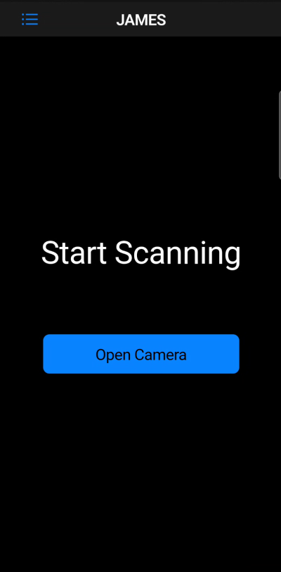
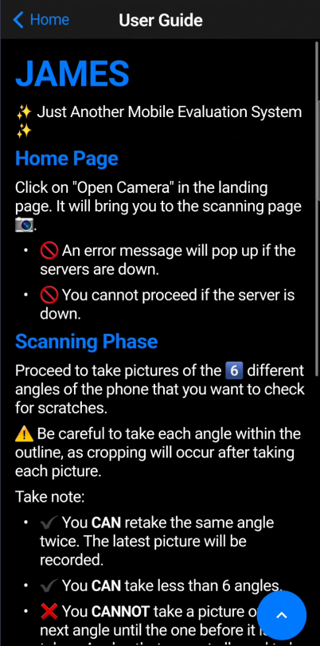
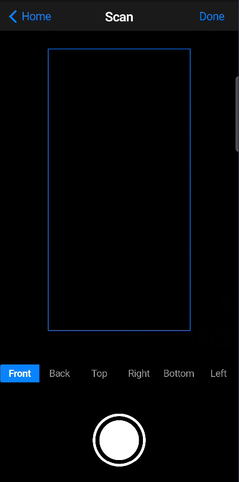
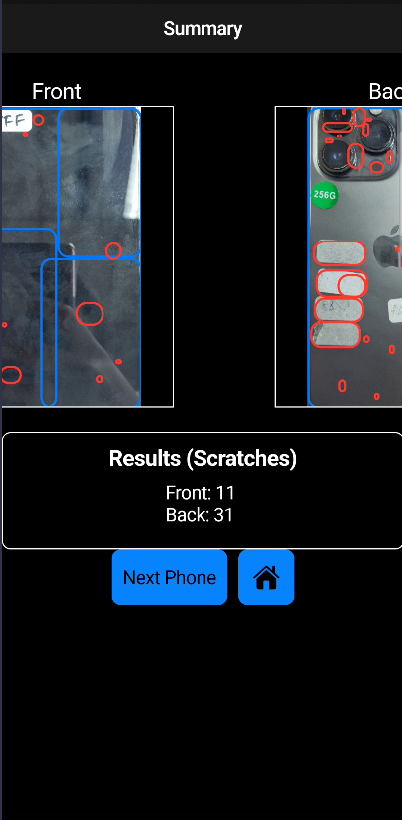

# james2024

JAMES stands for Just Another Mobile Evaluation System, and serves to seamlessly eliminate the
subjectivity of human evaluations. By using this app, simply capture the mobile phone at
6 different angles to get a final grade for the phone. We sprinkled in some AI ✨ to do the
evaluation for us.

## Introduction

This Project is a Flutter application. It consists of 3 Primary pages:
1. [Home Page](#home-page)
2. [Scanning Page](#scanning-page)
3. [Summary Page](#summary-page)

To download the application, follow the steps below.

Firstly, clone this repository onto your computer using the git clone command.

```shell
$ git clone <URL of this repository>
```

Then, cd to the root directory (~/james2024) and create a file called `.env` with the following
key value pair:

```
API_ENDPOINT=<URL of the server>
```

The URL of the server should be the IP address of the server that is hosting the AI model.
This can be found on the main computer with the many many monitors.

Then, make sure flutter is installed on the computer (duh >:0) Thereafter, run these commands
to check if you have successfully installed flutter and no errors are present.

```shell
$ flutter --version
$ flutter doctor
```

Finally, cd to this repository on your local computer, and plug in the android mobile device
that you want to download this application onto. Make sure that the device is discoverable by
flutter by running:

```shell
$ flutter devices
```

Once you find the device on the terminal, run these commands to install the application:

```shell
$ flutter build apk --debug
$ flutter install -d <device ID> --debug
```

Once the application is installed, it should show up on the mobile device and on launch,
you will be brought to the [Home Page](#home-page).

### Home Page

This is the screen that shows up upon launching the application.



On the top left side of the Navigation Bar, we have a drop down. The drop down only has a
User Guide, in which instructions to using the application can be found.



Upon clicking on the `Open Camera` button, the application will send a ping to check for server
availability. If the server is down, an error message will pop up and you cannot proceed to the
[Scanning Page](#scanning-page).

### Scanning Page

After clicking on `Open Camera` and when the server is available, you will be brought to the Scanning Page.



In this page, we have a camera overlay to show the guiding box in which the image of each angle of
the phone will be cropped at. Note that the current angle of the phone to be taken is highlighted by
the blue selection box in the `Angle Navigation Bar` on top of the camera capture button.

Also notice that the angles have to be taken in order. For instance, you cannot take the `Top` angle
before taking the `Front` angle.  
However, it is **possible** to retake an angle that is already taken previously. Only the latest image
will be sent to the server for processing.

It is also possible to submit less than 6 angles to the server for processing. Upon clicking `Done`,
there will be another check to see if the server is available, before all captured images
will be sent to the server for processing.

### Summary Page

After the images are processed by the server, you will be brought to the Summary Page.



Observe that the results will be displayed in a scrollable segment at the top with the appropriate
angle labels. The results are color coded:
- Blue boxes indicate that the AI detects a phone.
- Red boxes indicate a scratch.

The results shown are the total number of scratches detected for the respective angle. Note that the
final grade of the phone is still subject to your discretion.

There are 2 buttons available at the bottom of the page.  
⚠️These are **nuclear** processes. Meaning, upon clicking on either of the buttons, whatever current
phone images and detection will be **erased**.

- **Next phone**: Goes to camera for next phone to be processed.
- 🏠: Home page.
